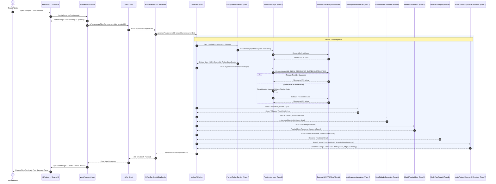

# NexusIVR AI Assistant — Complete Technical Architecture & End-to-End Pipeline README

> **Document Version**: 1.0.0  
> **Target System**: NexusIVR Platform — AI Engine & Tenant Web Application  
> **Source Verification**: Verified directly against source code in `IVR-AI-engine/` and `IVR-webapp/`.

---

## Table of Contents
1. [Executive Overview](#1-executive-overview)
2. [High-Level Architecture](#2-high-level-architecture)
3. [End-to-End User Flow](#3-end-to-end-user-flow)
   - [Mermaid Sequence Diagram](#mermaid-sequence-diagram)
4. [The Unified 7-Pass Generation Pipeline](#4-the-unified-7-pass-generation-pipeline)
   - [Pass 1: Prompt Refinement & Domain Analysis](#pass-1-prompt-refinement--domain-analysis)
   - [Pass 2: Raw VoiceXML LLM Generation](#pass-2-raw-voicexml-llm-generation)
   - [Pass 3: Robust Response Normalization](#pass-3-robust-response-normalization)
   - [Pass 4: DOM Parsing & Model Conversion](#pass-4-dom-parsing--model-conversion)
   - [Pass 5: Semantic Flow Model Validation](#pass-5-semantic-flow-model-validation)
   - [Pass 6: Deterministic Graph Auto-Repair](#pass-6-deterministic-graph-auto-repair)
   - [Pass 7: Dual Export & Canvas Layout Rendering](#pass-7-dual-export--canvas-layout-rendering)
5. [Patch-Based Flow Improvement (`IMPROVE_FLOW`)](#5-patch-based-flow-improvement-improve_flow)
6. [AI Assistant ↔ IVR Builder Canvas Integration](#6-ai-assistant--ivr-builder-canvas-integration)
7. [Provider Orchestration & Circuit Breaker](#7-provider-orchestration--circuit-breaker)
8. [RAG (Retrieval-Augmented Generation) Subsystem](#8-rag-retrieval-augmented-generation-subsystem)
9. [Error Handling & Resiliency Patterns](#9-error-handling--resiliency-patterns)
10. [Known Limitations & Architectural Trade-Offs](#10-known-limitations--architectural-trade-offs)

---

## 1. Executive Overview

The **NexusIVR AI Assistant** is an autonomous conversational and generative AI subsystem within the NexusIVR Platform. It enables tenant administrators to design, modify, validate, and analyze complex Interactive Voice Response (IVR) call flows using natural language prompts.

### Key Capabilities:
- **Full-Page & Drawer Interfaces**: Accessible either as a dedicated full-page screen (`/tenant/ai-assistant`) or as an embedded slide-over drawer directly within the visual canvas (`IVRBuilder.tsx`).
- **7-Pass Generation Pipeline**: Converts raw natural language prompts into standard VoiceXML 2.1 documents and visual React Flow node/edge graphs via multi-stage LLM generation, validation, and auto-repair.
- **Patch-Based Flow Optimization**: Modifies existing IVR flows incrementally using structured JSON patch operations (`ADD_NODE`, `DELETE_NODE`, `UPDATE_PROMPT`, etc.) with automatic score regression check and rollback protection.
- **Multi-Provider Orchestration & Resilience**: Features dynamic LLM provider failover (`Groq` → `OpenRouter` → `Gemini` → `Ollama` → `TemplateGenerator`) managed by an active state Circuit Breaker.
- **RAG Documentation Search**: Integrates with a local Python vector search microservice (`ragClient`) to pull platform documentation into general chat turns.

---

## 2. High-Level Architecture

The AI Assistant spans the React frontend web application, Java Servlets, Core AI Engine services, and an optional Python RAG microservice.

```
┌───────────────────────────────────────────────────────────────────────────────────┐
│                                FRONTEND (React)                                  │
│                                                                                   │
│  [AIAssistant Screen]       [IVRBuilder Canvas] ──> [AiAssistantPanel Drawer]    │
│            │                        │                          │                  │
│            └────────────────────────┴──────────────────────────┘                  │
│                                     │                                             │
│                           useAIAssistant Hook                                     │
│                                     │                                             │
│                            aiApi REST Client                                      │
└─────────────────────────────────────┬─────────────────────────────────────────────┘
                                      │ HTTP / REST
┌─────────────────────────────────────▼─────────────────────────────────────────────┐
│                             BACKEND (Java / Servlet)                              │
│                                                                                   │
│               [AiFlowServlet]                   [AiChatServlet]                   │
│                      │                                 │                          │
│                      └────────────────────────┬────────┘                          │
│                                               │                                   │
│                                   [AiOperationRouter]                             │
│                                               │                                   │
│                                      [UnifiedAiEngine]                            │
│                                               │                                   │
│        ┌──────────────────────────────────────┼──────────────────────────┐        │
│        │                                      │                          │        │
│ [PromptRefinerService]              [ProviderManager]            [RagClient]      │
│ (Pass 1 Refinement)               (Fallback Priority Chain)           │           │
│        │                                      │                       │           │
│ [LlmResponseNormalizer]             [CircuitBreaker]            [Python RAG]      │
│ (Pass 3 Sanitization)                         │                 (Vector Search)   │
│        │                              ┌───────┴───────┐                           │
│ [VxmlToModelConverter]              Groq          OpenRouter                      │
│ (Pass 4 DOM Parsing)               Gemini           Ollama                        │
│        │                                                                          │
│ [ModelFlowValidator]                                                              │
│ (Pass 5 Validation)                                                               │
│        │                                                                          │
│ [ModelAutoRepair]                                                                 │
│ (Pass 6 Graph Repair)                                                             │
│        │                                                                          │
│ [ModelToVxmlExporter] & [ModelToFlowRenderer]                                     │
│ (Pass 7 Export & Layout Rendering)                                                │
└───────────────────────────────────────────────────────────────────────────────────┘
```

### Component Directory Mapping:
- **Frontend Screen**: [`IVR-webapp/src/screens/AIAssistant.tsx`](file:///home/mohesham/Desktop/IVR-Platform/IVR-webapp/src/screens/AIAssistant.tsx)
- **Embedded Drawer**: [`IVR-webapp/src/components/AiAssistantPanel.tsx`](file:///home/mohesham/Desktop/IVR-Platform/IVR-webapp/src/components/AiAssistantPanel.tsx)
- **Shared Custom Hook**: [`IVR-webapp/src/hooks/useAIAssistant.ts`](file:///home/mohesham/Desktop/IVR-Platform/IVR-webapp/src/hooks/useAIAssistant.ts)
- **API Client**: [`IVR-webapp/src/api/aiApi.ts`](file:///home/mohesham/Desktop/IVR-Platform/IVR-webapp/src/api/aiApi.ts)
- **Servlet Controllers**: [`AiFlowServlet.java`](file:///home/mohesham/Desktop/IVR-Platform/IVR-AI-engine/src/main/java/com/nexusivr/ai/controller/AiFlowServlet.java), [`AiChatServlet.java`](file:///home/mohesham/Desktop/IVR-Platform/IVR-AI-engine/src/main/java/com/nexusivr/ai/controller/AiChatServlet.java)
- **Core Orchestrator**: [`UnifiedAiEngine.java`](file:///home/mohesham/Desktop/IVR-Platform/IVR-AI-engine/src/main/java/com/nexusivr/ai/service/UnifiedAiEngine.java)
- **LLM Provider Orchestrator**: [`ProviderManager.java`](file:///home/mohesham/Desktop/IVR-Platform/IVR-AI-engine/src/main/java/com/nexusivr/ai/ai/ProviderManager.java)
- **Circuit Breaker**: [`CircuitBreaker.java`](file:///home/mohesham/Desktop/IVR-Platform/IVR-AI-engine/src/main/java/com/nexusivr/ai/ai/CircuitBreaker.java)

---

## 3. End-to-End User Flow

When a user enters a prompt to generate an IVR flow (e.g. *"Create a bilingual customer support flow for telecom with billing, technical support, and main menu"*):

1. **User Interaction**: User submits prompt on `AIAssistant.tsx` or `AiAssistantPanel.tsx`.
2. **Stage Progression**: `useAIAssistant` transitions through active loading stages:
   `understanding` → `analysis` → `planning` → `template` → `generating` → `validating` → `converting` → `rendering` → `idle`.
3. **API Request**: `aiApi.generateFlow()` sends a POST request to `/api/v1/ai/flow/generate`.
4. **Servlet & Intent Classification**: `AiFlowServlet` handles the request. If routed through `/chat`, `AiOperationRouter` inspects the message intent using `detectIntent()`:
   - `GENERATE_FLOW` → Invokes `UnifiedAiEngine.generateFlow()`.
   - `IMPROVE_FLOW` → Invokes `UnifiedAiEngine.improveFlowWithPatches()`.
   - `FLOW_ANALYSIS` / `FLOW_QUESTION` → Answered deterministically from `SessionMemoryStore` or grounded via compact flow summary.
   - `GENERAL_CHAT` → Passed to LLM with RAG documentation citations.
5. **Unified 7-Pass Pipeline Execution**: `UnifiedAiEngine` executes Passes 1 through 7.
6. **Response Payload**: Backend returns a `FlowGenerationResponse` containing `flowJson` (React Flow canvas structure), `voicexml` (VoiceXML 2.1 code), `refinedPrompt`, `droppedFeatures`, and provider execution metadata (`selectedProvider`, `actualProviderUsed`, `fallbackUsed`, `fallbackReason`).
7. **Canvas Synchronization**: `useAIAssistant` updates state, stores flow data in `localStorage` under `nexus_flow_${sessionId}`, and optionally navigates the user to `/tenant/ivr-builder` with state.

### Mermaid Sequence Diagram



---

## 4. The Unified 7-Pass Generation Pipeline

The core intelligence of the AI Assistant resides in `UnifiedAiEngine.java`. Generation is decomposed into 7 distinct passes to guarantee syntactic correctness and structural sanity.

```
[Raw User Prompt] ──> Pass 1: Refinement ──> Pass 2: LLM Gen ──> Pass 3: Normalization
                                                                         │
[React Flow JSON + VoiceXML] <── Pass 7: Dual Export <── Pass 6: Auto-Repair <── Pass 5: Validation <── Pass 4: DOM Parse
```

### Pass 1: Prompt Refinement & Domain Analysis
- **Class**: [`PromptRefinerService.java`](file:///home/mohesham/Desktop/IVR-Platform/IVR-AI-engine/src/main/java/com/nexusivr/ai/service/PromptRefinerService.java)
- **Role**: Expands ambiguous user prompts into structured specifications.
- **Process**:
  1. Runs lightweight domain analysis (`DomainDetector.detect()`) to identify industry vertical (e.g. `TELECOM`, `BANKING`, `HEALTHCARE`).
  2. Calls LLM with `REFINER_SYSTEM_INSTRUCTION` instructing it to output a JSON object containing:
     - `industry_domain`, `detected_intent`, `inferred_department`
     - `extracted_features`, `suggested_missing_features`
     - `menu_options` (key/label mappings)
     - `call_routing_destinations`
  3. Caches refined specs in `RefinedSpecCache` (keyed by tenant/prompt hash) to prevent duplicate refinement calls.

### Pass 2: Raw VoiceXML LLM Generation
- **Class**: [`UnifiedAiEngine.java`](file:///home/mohesham/Desktop/IVR-Platform/IVR-AI-engine/src/main/java/com/nexusivr/ai/service/UnifiedAiEngine.java) & [`ProviderManager.java`](file:///home/mohesham/Desktop/IVR-Platform/IVR-AI-engine/src/main/java/com/nexusivr/ai/ai/ProviderManager.java)
- **Role**: Generates standard VoiceXML 2.1 code based on the Pass 1 specification.
- **Process**:
  1. Formats prompt using `FLOW_GENERATOR_SYSTEM_INSTRUCTION`.
  2. Checks `SemanticCache` for existing identical prompt matches.
  3. Passes instruction to `ProviderManager`.
  4. If the returned string fails XML parsing, retries generation **once** with an explicit error correction prompt.

### Pass 3: Robust Response Normalization
- **Class**: [`LlmResponseNormalizer.java`](file:///home/mohesham/Desktop/IVR-Platform/IVR-AI-engine/src/main/java/com/nexusivr/ai/service/LlmResponseNormalizer.java)
- **Role**: Pre-processes raw LLM text output into clean, parsable XML before DOM evaluation.
- **Transformations**:
  1. **BOM Removal**: Strips UTF-8 Byte Order Mark (`\uFEFF`).
  2. **Unescaping**: Unescapes JSON-string wrapped escape sequences (`\"` → `"`, `\n` → newline).
  3. **JSON Extraction**: If LLM wrapped XML in JSON (`{"vxml": "..."}` or `{"nodes": [...]}`), extracts internal XML string or converts JSON flow to VoiceXML structure (`convertJsonFlowToVxml()`).
  4. **Code Fence Stripping**: Extracts XML from markdown code blocks (` ```xml ... ``` `).
  5. **Prose Cleanup**: Extracts `<vxml>` blocks from surrounding conversational text.
  6. **XML Sanitization**: Removes stray non-whitespace characters between XML declaration and `<vxml>` root; replaces bare ampersands (`&`) with `&amp;`.
  7. **Validation**: Verifies closing `</vxml>` tag exists (throws `LlmResponseNormalizationException` if truncated due to token ceilings).

### Pass 4: DOM Parsing & Model Conversion
- **Class**: [`VxmlToModelConverter.java`](file:///home/mohesham/Desktop/IVR-Platform/IVR-AI-engine/src/main/java/com/nexusivr/ai/service/VxmlToModelConverter.java)
- **Role**: Parses VoiceXML DOM into an in-memory `FlowModel` graph object.
- **Parsing Rules**:
  - VoiceXML `<form>` and `<menu>` elements map to `FlowNode` objects.
  - Form tags (`<block>`, `<field>`, `<menu>`, `<transfer>`, `<if>`, `<subdialog>`, `<ai>`) are mapped to internal node types (`START`, `PROMPT`, `MENU`, `INPUT`, `TRANSFER`, `CONDITION`, `AI`, `END`).
  - `<choice>` and `<goto>` elements are extracted to build directed graph edges (`FlowConnection`).
  - Extracted bilingual prompt text: Automatically parses `xml:lang="en"` / `xml:lang="ar"`, child `<en>`/`<ar>` tags, or Arabic script detection into `promptEn` and `promptAr` properties.

### Pass 5: Semantic Flow Model Validation
- **Class**: [`ModelFlowValidator.java`](file:///home/mohesham/Desktop/IVR-Platform/IVR-AI-engine/src/main/java/com/nexusivr/ai/service/ModelFlowValidator.java)
- **Role**: Performs rule-based validation on the `FlowModel` graph.
- **Checked Rules**:
  1. **Start Node Rule**: Must contain exactly one `START` node.
  2. **End Node Rule**: Must contain at least one `END`/`DISCONNECT` node.
  3. **Duplicate ID Rule**: Checks for unique node IDs.
  4. **Orphan Node Rule**: Identifies nodes disconnected from the graph.
  5. **Reachability Rule**: Verifies an `END` node is reachable from `START` via Breadth-First Search (BFS).
  6. **Unreachable Nodes**: Detects sub-graphs detached from the entry point.
  7. **Menu Constraints**: Verifies `MENU` nodes contain valid choices.
  8. **Transfer Constraints**: Ensures `TRANSFER` nodes specify valid destinations (flagging placeholder strings or plain human role names).
  9. **Terminal Edge Rule**: Ensures `END` nodes have no outgoing connections.
- **Scoring**: Computes a score from `0` to `100` based on weighted issue severity.

### Pass 6: Deterministic Graph Auto-Repair
- **Class**: [`ModelAutoRepair.java`](file:///home/mohesham/Desktop/IVR-Platform/IVR-AI-engine/src/main/java/com/nexusivr/ai/service/ModelAutoRepair.java)
- **Role**: Fixes validation issues deterministically on the graph **without calling the LLM**.
- **Repair Strategy ("Repair First, Delete Last")**:
  - **Phase 0**: Renames duplicate node IDs.
  - **Phase 1**: Inserts missing `START` or `END` nodes if omitted by LLM. Assigns auto-incrementing extension numbers (e.g. `101`, `102`) to empty transfer destinations.
  - **Phase 2**: Reconnects orphan nodes to menu choices or condition branches.
  - **Phase 3**: Remaps invalid output ports to valid ports allowed for the node type (e.g. remapping invalid menu ports to `key1`, `key2`).
  - **Phase 4**: Connects leaf nodes, transfer `fail`/`success` ports, and menu `timeout` ports to `END` nodes.
  - **Phase 4.5**: Wires disconnected fallback DTMF menus to AI nodes' `nomatch` ports.
  - **Phase 5 & 6**: Reconnects unreachable feature nodes. Deletes truly unrecoverable nodes **only** if they represent < 50% of the total flow count; otherwise aborts deletion and forces reconnection.

### Pass 7: Dual Export & Canvas Layout Rendering
- **Classes**: [`ModelToVxmlExporter.java`](file:///home/mohesham/Desktop/IVR-Platform/IVR-AI-engine/src/main/java/com/nexusivr/ai/service/ModelToVxmlExporter.java) & [`ModelToFlowRenderer.java`](file:///home/mohesham/Desktop/IVR-Platform/IVR-AI-engine/src/main/java/com/nexusivr/ai/service/ModelToFlowRenderer.java)
- **Role**: Produces canonical VoiceXML and computes React Flow layout coordinates.
- **Canvas Layout Math**:
  - Computes visual hierarchy using BFS level ordering.
  - Sets horizontal spacing (`X_SPACING = 320px`) and vertical spacing (`Y_SPACING = 160px`).
  - Centers nodes dynamically per level to prevent overlapping canvas edges.
  - Generates serializable React Flow JSON structure (`nodes`, `edges`, `summary`).

---

## 5. Patch-Based Flow Improvement (`IMPROVE_FLOW`)

When a user requests modifications to an existing flow (e.g. *"Add a callback option to the main menu"*), the system executes a **Patch-Based Optimization** workflow rather than re-generating the flow from scratch.

### Implementation Pathway:
1. **Flow Model Conversion**: Converts current canvas VXML/JSON to `FlowModel`.
2. **Current Audit**: Runs `ModelFlowValidator` on existing flow to compute baseline score.
3. **Compact Summary**: Generates compact topology text via `FlowSummaryBuilder.buildCompactSummary()`.
4. **Patch Prompting**: Calls LLM with `buildPatchSystemPrompt()` instructing it to output an array of atomic patch operations:
   ```json
   [
     { "op": "ADD_NODE", "node": { "id": "callback_node", "type": "input", "title": "Request Callback" } },
     { "op": "ADD_EDGE", "edge": { "source": "main_menu", "sourcePort": "key4", "target": "callback_node" } },
     { "op": "UPDATE_PROMPT", "nodeId": "main_menu", "promptEn": "Press 4 for callback." }
   ]
   ```
5. **Supported Operations** ([`FlowPatchApplier.java`](file:///home/mohesham/Desktop/IVR-Platform/IVR-AI-engine/src/main/java/com/nexusivr/ai/service/FlowPatchApplier.java)):
   - `ADD_NODE`, `DELETE_NODE`, `RENAME_NODE`
   - `ADD_EDGE`, `DELETE_EDGE`
   - `UPDATE_PROMPT`, `CHANGE_MENU_OPTION`, `MOVE_SUBTREE`
6. **Validation & Rollback Protection**:
   - `FlowValidationOrchestrator` validates and auto-repairs the patched flow.
   - **Automatic Rollback**: If post-patch score regresses compared to pre-patch score, or if node/edge count drops by more than 50%, changes are **completely rolled back** to the original flow, returning a warning notice to the user.

---

## 6. AI Assistant ↔ IVR Builder Canvas Integration

The AI Assistant and visual IVR Builder canvas share flow state seamlessly across routing modes.

### 1. Embedded Panel Mode (`IVRBuilder.tsx` + `AiAssistantPanel.tsx`)
- When open inside the canvas screen, `AiAssistantPanel` renders as a slide-over drawer on the right.
- Flow generation invokes the `onFlowGenerated` callback prop, directly updating React Flow's `nodes` and `edges` state in `IVRBuilder` without requiring a page reload.

### 2. Standalone Page Mode (`AIAssistant.tsx` → `/tenant/ivr-builder`)
- When generated on the full AI Assistant screen, clicking **"Open in IVR Builder"** triggers React Router navigation:
  ```ts
  navigate('/tenant/ivr-builder', {
    state: { nodes, edges, flowName, sessionId }
  });
  ```
- `IVRBuilder.tsx` reads `location.state` on mount and initializes the canvas.

### 3. LocalStorage State Persistence
To ensure flows persist across browser refreshes and tab switches, state is synchronized via `localStorage`:
- `nexus_ai_session_id`: Active AI session UUID.
- `nexus_flow_${sessionId}`: Raw VoiceXML string.
- `nexus_builder_nodes_${sessionId}`: Serialized React Flow nodes.
- `nexus_builder_edges_${sessionId}`: Serialized React Flow edges.
- `nexus_builder_flowname_${sessionId}`: Active flow title.

---

## 7. Provider Orchestration & Circuit Breaker

The backend delegates LLM calls through [`ProviderManager.java`](file:///home/mohesham/Desktop/IVR-Platform/IVR-AI-engine/src/main/java/com/nexusivr/ai/ai/ProviderManager.java) to eliminate single-point-of-failure risks associated with third-party LLM APIs.

### Fallback Priority Chain
```
[User Request] ──> Groq (llama-3.3-70b-versatile)
                       │ (On 429 / 5xx / Timeout)
                       ▼
                 OpenRouter (openai/gpt-oss-20b)
                       │ (On 429 / 5xx / Timeout)
                       ▼
                 Gemini (gemini-2.0-flash)
                       │ (On 429 / 5xx / Timeout)
                       ▼
                 Ollama (granite3.2:2b)
                       │ (If local Ollama offline)
                       ▼
                 TemplateGenerator (Deterministic Fallback)
```

### Circuit Breaker State Machine ([`CircuitBreaker.java`](file:///home/mohesham/Desktop/IVR-Platform/IVR-AI-engine/src/main/java/com/nexusivr/ai/ai/CircuitBreaker.java))
Each provider is guarded by an individual circuit breaker tracking three states:
- **`CLOSED`**: Operational; requests pass through.
- **`OPEN`**: Provider is failing; requests bypass this provider immediately.
- **`HALF_OPEN`**: Probe mode after cooldown expires; allows a single test request to check recovery.

#### Configured Cooldown Timers:
- **HTTP 429 Rate Limit / Quota Exceeded**: 5-minute cooldown (`300,000 ms`).
- **HTTP 401 / 403 Auth Failure**: 10-minute cooldown (`600,000 ms`).
- **HTTP 5xx Server Error**: 30-second cooldown (`30,000 ms`).
- **Failure Threshold**: 3 consecutive failures trigger `OPEN` state.

### UI Transparency & Banners
- API responses include `actualProviderUsed` and `fallbackUsed`.
- If the requested provider (e.g. Groq) fails and Gemini fulfills the request, `AIAssistant.tsx` displays an informational amber banner:
  > *"Groq failed. Response generated using gemini-2.0-flash."*
- If all LLM providers fail, the system falls back to `TemplateGenerator` and displays a template warning notice.

---

## 8. RAG (Retrieval-Augmented Generation) Subsystem

For non-generation conversational turns (asking general questions about NexusIVR platform features), `ChatService.java` integrates with an isolated Python vector search microservice via [`RagClient.java`](file:///home/mohesham/Desktop/IVR-Platform/IVR-AI-engine/src/main/java/com/nexusivr/ai/rag/RagClient.java).

### RAG Workflow:
1. `ChatService.sendMessage()` receives user prompt.
2. `RagClient.queryRag(userMessage, topK=5, minScore=0.35)` posts query to `http://localhost:8000/query`.
3. If relevant documentation chunks match score criteria:
   - Appends text snippets to the prompt under `### Relevant Context:`.
   - Instructs LLM to answer using only context and include inline citations (`[Source: filename, Section]`).
4. `ChatResponse` payload returns formatted source citations to the UI.

---

## 9. Error Handling & Resiliency Strategies

1. **Database Offline Resilience**: If PostgreSQL is unavailable, `ChatService` and `AiFlowServlet` catch database exceptions and switch to transient in-memory sessions using `SessionMemoryStore`, allowing AI generation to function unimpeded.
2. **Malformed XML Recovery**: If Pass 2 produces unparsable XML, `LlmResponseNormalizer` attempts JSON/markdown fence extraction. If parsing still fails, `UnifiedAiEngine` executes a dedicated correction prompt retry before invoking auto-repair.
3. **Token Truncation Safeguard**: `LlmResponseNormalizer` validates the presence of `</vxml>`. Truncated responses throw an explicit error prompting maximum token adjustments rather than returning corrupted flows.
4. **Patch Regression Protection**: `FlowValidationOrchestrator` verifies patch execution. If an optimization attempt lowers the flow quality score or loses > 50% of nodes, the system automatically rolls back changes.

---

## 10. Known Limitations & Architectural Trade-Offs

- **No Streaming API Support**: Servlet endpoints currently return complete JSON payloads (`FlowGenerationResponse`) rather than Server-Sent Events (SSE) or WebSockets. Frontend stage animation steppers simulate progression during long LLM calls.
- **RAG Dependency**: The Python RAG service (`ragClient`) runs as an optional external process on port 8000. If offline, general chat queries fall back gracefully to standard ungrounded LLM completions without throwing errors.
- **Single Active Session Per Canvas**: State in `localStorage` uses `nexus_flow_${sessionId}`. Simultaneous generation across multiple browser tabs sharing the same session ID can cause transient canvas state overrides.
